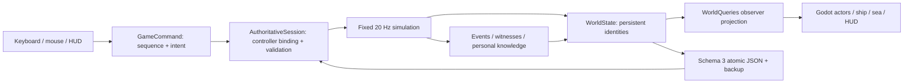

# Implemented architecture — alpha 0.3.0

The alpha is a local authoritative simulation with a Godot presentation. This document describes working code. The full design remains in [GAME_DESIGN](GAME_DESIGN.md); the earlier handoff is preserved in [reference/ARCHITECTURE_HANDOFF](reference/ARCHITECTURE_HANDOFF.md).

## Runtime flow

`AlphaGame` owns one local session and binds the local controller to Rowan. UI buttons and movement send commands. The authority resolves identity from the controller; a command cannot specify an actor to impersonate. Increasing sequence numbers prevent replay within a session. Invalid quantities, non-finite vectors, missing IDs, impossible locations, insufficient money and action cooldowns are rejected. Held movement expires after eight ticks without another input.

A non-repeating Shift press sends `SetRun` with an explicit 0/1 preference. `Person.RunEnabled` persists independently of held direction and defaults to false in a new voyage. The authority selects walking or running speed with the same injury and collision rules. Carrying a provision crate slows movement without clearing the preference. Menus ignore the shortcut, and stopping or crossing coordinate frames retains the selection. Presentation shows Run ON/OFF and derives gait from observed local travel.

Presentation code reads local world data and observer projections; it does not change consequential game state. Runtime tests deliberately modify fixtures to reach specific scenes. The current local view still has direct read access to `WorldState`; converting every screen to transport-safe DTOs is required before networking. A local public model is not an anti-cheat boundary.

## Source map

| Location | Responsibility |
|---|---|
| `Core/Models.cs` | Persistent people, ships, islands, ownership, relationships, beliefs, arcs and delivery contracts |
| `Core/AuthoritativeSession.cs` | Controller ownership, sequencing, command routing, fixed ticking, NPC choices and local steering |
| `Core/WorldFactory.cs`, `WorldLayout.cs` | Seeded world and semantic collision/station layout shared by authority and art |
| `Core/IslandLayout.cs`, `IslandGeneration.cs` | Saved coastline, walk boundary, rotated harbour, roads, solids and interaction approaches |
| `Core/ShipPaths.cs` | Shared deck grids and cached distance fields for obstacle-aware ship routes |
| `Core/IslandPaths.cs`, `HarbourAccess.cs` | Routes through saved shore geometry and continuous ship/pier crossings |
| `Core/Navigation.cs` | Helm, routes, anchor, discovery, landings, ship avoidance, crew meals |
| `Core/EconomyAndDuties.cs`, `Deliveries.cs` | Finite money/items, trade, equipment, duty, healing and reserved delivery payments |
| `Core/CargoLoading.cs`, `LoadingActions.cs` | Persistent First Watch crates, carry/drop/stow rules, finite wage escrow and helper choice |
| `Core/Relationships.cs`, `SocialOrbits.cs`, `SocialActions.cs` | Social attraction, contact, obligations, mediation, recruiting and command support |
| `Core/Events.cs` | Canonical events, proximity witnesses, personal memory and decaying rumor confidence |
| `Core/CombatAndStory.cs`, `PortLife.cs` | Combat, naval response, injury/death, leadership, occupational succession and small story arcs |
| `Core/WorldQueries.cs` | Actor-specific visible people, chart entries, known accounts and known arcs |
| `Core/SaveStore.cs` | Validation, serialization, atomic replacement and previous-save recovery |
| `Scripts/AlphaGame.cs` | Godot/session bridge, input, selection, pause, save controls and scene lifecycle |
| `Scripts/Presentation/` | Ship/island meshes, paper people, sea camera, chart/orbit graphics, HUD and procedural sound |
| `Scripts/Presentation/PaperActor.cs`, `PaperDollArt.cs` | Shared articulated paper rig, observed-action poses, two-bone limb targets and cached interchangeable art pieces |
| `Scripts/Presentation/IslandVisual.cs`, `ProvisionVisual.cs` | Saved island geometry and grounded provision-crate presentation |
| `Scripts/AlphaChecks.cs` | Opt-in engine integration and screenshot checks |
| `Tests/` | Standalone .NET integration checks with no Godot or test-service dependency |
| `Scenes/Alpha.tscn` | Small runtime scene entry |
| `Scripts/*Prototype*`, `PaperPlayer.cs`, `ShipCamera.cs` | Preserved 0.1.0 comparison scene |

`IslandGlow.Core.csproj` references only .NET libraries. `IslandGlow.csproj` references it and excludes its source files from duplicate compilation. `Tests` and `Core` have `.gdignore` files because Godot imports presentation resources, not simulation source. `IslandGlow.sln` supports Godot's C# exporter and IDEs.

## Identity and space

People, possessions, ships and islands use stable string IDs. A person has a place ID, deck and local position. Ship-local positions rotate and translate with the ship; island-local positions translate with the island. Switching deck/shore changes location, not identity. Dead people remain records. Role replacement and inheritance transfer responsibility/property without replacing the person.

Each island stores an `IslandLayout`: coast and walk polygons, solid footprints, paths, stations, town square, pier, cargo pickup, anchorage and berth heading. `IslandGeneration` builds this definition once from the voyage seed. `IslandVisual`, authoritative collision and shore routes consume the saved definition; loading does not regenerate occupied terrain. `StartIslandId`, `NearbyPortId` and `NearbySalvageId` identify the opening region without relying on fixed names or coordinates. The generator varies a bounded set of harbour/town arrangements and flat terrain; it is not a general terrain or city generator.

`Core/HarbourAccess.cs` reads the saved pier and berth geometry. The authority changes place/coordinate frame when movement crosses the open port gate, preserving world position, facing, identity and possessions. Anchored vessels settle into their berth before deploying; departure waits while someone occupies the crossing. `GangwayVisual`, the ship rail opening and the island pier use this same geometry. `MaritimeView` interpolates foot height along the short ramp and keeps the camera following continuously. The HUD offers walking guidance rather than a shore-transfer button.

The simulation uses double-precision 2D maritime coordinates. Rendering subtracts the player's ship position to keep local geometry near the origin. Walking uses swept substeps against a convex hull, ship solids, saved land boundaries, pier, town obstacles and grounded provision crates. Both decks use shared semantic furniture footprints. Ship NPCs follow shared grid distance fields; island NPCs use a visibility graph over saved roads and building approaches, with local spacing and obstacle steering. Waypoint intentions persist; route caches are derived from geometry. Sailing uses angular steering, lateral vessel passing and conservative separation sized for the enlarged hull. It is not full hydrodynamics.

The camera is one orthographic camera. An exponential size curve spans about 14 to 24,500 world units with smooth focus blending and panning. Near/far planes vary with size. Detail and people disappear at appropriate distances; unconfirmed shores are markers at their reported locations. A below-deck view hides the upper structure and cuts the ocean around the deck footprint.

The shared hull is 72×26 units. Walking starts at camera size 35.6 with approximately 53° elevation; focus remains with the person until size 60 and blends toward ship centre by 115. The ocean cutaway receives the same hull vertices as the authority. Close views remove overhead rigging/canvas while retaining visible mast bases. Crew rotate among occupied station slots, local work, mess gatherings, off-watch time and berths; some stay on night watch. Presentation poses use observed activities and local walking distance rather than vessel motion.

`PaperActor` uses a shared native `Node3D` joint hierarchy with separate head, torso, limb and equipment sprites. Its common parent faces the camera so child joint rotations remain visible. Authored C# pose curves and two-bone hand/foot targets supply walking, running, carrying, work, conversation, combat and rest motion; these are procedural poses rather than `AnimationPlayer` clips. `PaperDollArt` caches pieces by the appearance inputs that change their pixels. `PersonView` exposes blocking, last-hit timing and `CarriedItemKind` alongside observed action windows; animation reads them without writing consequential state. Core retains zero Godot dependencies. See [CHARACTER_ANIMATION](CHARACTER_ANIMATION.md) for pivots, replacement art and current directional/contact limits.

The world seed, PRNG state and generated island definitions persist. New Voyage selects a fresh seed; a given seed remains reproducible. The archipelago contains 56 islands over eight regions, nine ports and nine ships, with Rowan plus twelve NPCs in the starting crew. It has a deliberately small activity vocabulary rather than 56 individually authored locations.

Autopilot chooses an explicit bypass around coastlines that intersect its course and reduces speed during sharp turns. Close to a coast, that safe direction takes priority over lateral vessel avoidance; physical separation still stops ships from overlapping. This handles departures from rotated berths toward the far side of an island. Manual helm input retains its direct steering behavior.

## Social gravity

Each directed edge stores trust, affection, fear, grievance, debt, familiarity, contact time and a reason. Pull combines affinity, unresolved obligations/conflict, growing time apart, personal courage, avoidance and opportunity. NPCs select contacts using that pull, walk toward them, meet at plausible proximity, then separate into duties/rest. The score can motivate movement between decks; it does not yet schedule independent voyages to distant people.

Encounters update both directed edges and transmit accounts. Debtors with sufficient funds may repay a creditor. Players can fund repayment or mediate while both parties are present. Crime reports can lower a third party's trust; reports of help can raise it. Conversation changes later choices, giving the loop memory. The orbit display is derived from personal ties and known encounters, with reported links distinguished from witnessed ones.

Canonical events are distinct from beliefs. A belief retains speaker/source, suspected actor, confidence, hops, kind, target and summary. Direct witnesses learn immediately; rumors lose confidence and stop after four hops. Witnessing currently uses place/deck/proximity rather than full line of sight. Private inventories are not shown wholesale when inspecting a living person. Exact private NPC relationship scores are not displayed to the player.

## Economy and consequences

Integer bronze avoids rounding money. One silver = 100 bronze, one gold = 100 silver; these are provisional balance values. Trades move existing cash and items; duties pay from the ship's treasury. Prices use local export/import multipliers. Stack splits keep a new stack ID and the original origin ID. Unique equipment retains the same ID on sale, gift, theft and inheritance.

Delivery acceptance moves real merchant cargo and reserves real money in escrow. Parcels retain a contract ID through storage/splitting; they cannot be eaten, gifted or sold. Arrival at the destination market transfers them and releases escrow once. Death of the issuer does not break an accepted contract. There is one finite offer per starting harbour.

First Watch is a separate physical loading job. Three stacks are split from existing ship provisions into persistent ship-owned pier crates. Until stowed, they are excluded from usable stock, consumption and ordinary inventory transfers. The player accepts at the aft STOW station, picks up one nearby crate, walks it aboard and stows it there. Grounded crates have collision; carried/stowed ones do not. Carrying blocks actions that need free hands and preserves the run preference while limiting speed. Drop, incapacitation or death places the crate on nearby permanent footing, clear of standing people and other crates. Carrier identity, dropped location and stowed state survive saving.

Acceptance reserves 90 bronze from the ship's treasury. Each of the first two stows pays 30 bronze once. Before the third load, the player explicitly chooses to earn its 30 bronze or carry it for a living crewmate who keeps that wage. Helping changes that crewmate's trust and affection; overtime has no relationship penalty. A missing/dead/departed helper cannot block completion: the final wage falls back to the worker. Actual recipients, totals and the completed outcome persist. The job can be left unfinished without locking sailing, and there is no autonomous NPC hauling planner in this slice.

Fists stop at incapacitation; weapons can kill. Blocking, dodge timing, powder, cooldowns and proximity are core rules. NPCs defend themselves. Naval gunfire changes hull state and enemy knowledge/relationships; surviving gun crews can answer and damaged ships flee. Disabled hulls stay afloat. Leadership and occupation vacancies have replacements when eligible people survive; an empty crew or town has no magically spawned essential character.

The story layer tracks supply shortages, debts, rivalries and the resolved First Watch outcome. It creates/resolves journal threads from state; it is not the full ambition-driven Story Director in the design. Offline dialogue uses grounded templates plus actual local knowledge. There is no LLM dependency.

## Persistence and time

The authority runs at 20 ticks/second. One simulated real-time second advances 1.2 in-world minutes. UI time controls advance all systems together; they do not only speed the boat. Menus pause the offline session. Per-person milestones support future independent players.

Schema 3 serializes world records, generation/layout versions, saved island geometry, clock, cooldowns, tasks, knowledge, charts, contracts and physical loading progress. Save validation checks cargo identity, ownership, carrier links, footing, paid recipients and escrow consistency alongside the existing world rules. The normal filename is `%LOCALAPPDATA%/IslandGlow/alpha-v3.json`; engine verification and manual QA use separate v3 profiles.

Andrew explicitly approved fresh saves for 0.3.0. Schemas 1 and 2 are rejected; there is no migration, and the v3 filename leaves earlier save files separate. A flushed temporary file replaces the primary; the previous valid primary becomes the backup. Corrupt primary files do not overwrite the good backup. Load tries primary then backup and preserves both if neither works. Loading uses saved layouts and positions rather than regenerating or silently relocating the world.

The hot canonical event window is capped near 2,000 events; each person keeps up to 120 memory references and 300 beliefs with summaries. Item transfer histories persist. This deliberately bounds some history, so it is not a permanent complete event archive. A future server needs cold event/history storage and migrations, described in [MULTIPLAYER](MULTIPLAYER.md).

## Extend by vertical slices

Add a rule/model to Core, expose a command and observer result, then wire one playable interaction and meaningful verification. Keep art/layout coordinates shared when collision matters. Do not add empty services for features that cannot yet be played. Record limitations, schema changes and assumptions in the decision/issue logs. Use the build-out wireframe and backlog to improve one location/system without coupling identity to scene lifetime.
