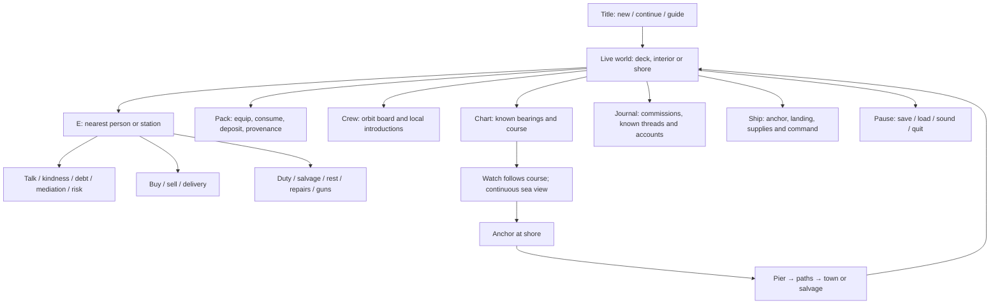

# World and interface build-out

This is the alpha's working wireframe, not a promise that every future area is complete. The same simulation powers every visible scale.

## Player flow

All panels pause this offline world. Consequential buttons submit commands and report rejection clearly. Tests drive real key/wheel and UI button events. Future online panels will be non-pausing and must tolerate state changing while a panel is open.

## Location contract

| Area | Working affordances | Shared layout | Next focused expansion |
|---|---|---|---|
| Main deck | Wheel aft, cargo, bucket, bench, cannon, companionway; living crew | Convex hull + mast/hatch/cargo/gun collision; named station points | Better station silhouettes, direction animations, occupied work spots |
| Lower deck | Hammocks, galley, stores/table, stairs; cutaway rendering | Same hull bounds and deck index | Separate cabins/rooms, furniture collision, better sleep/cook routines |
| Harbour | Southern pier/anchorage, market, tavern, shipwright, residents | Land/pier boundary and building solids; port-specific identity/economy | Distinct neighbourhood layouts, shops/interiors, local schedules and conflicts |
| Wild shore | Landing path, finite washed-up cargo, water; coast/palms/crags | Safe inland boundary, pier and ridge obstacles | Several island archetypes, resource ecology, traversable terrain/points of interest |
| Sea | Watch/manual sailing, trade routes, discovery, hailing and cannon encounters | World coordinate field and island/vessel clearance | Better pilot/path planning, weather, boarding, wrecks, ship acquisition |
| Region/world | One camera, known sightings/reports, panning and scale | Observer chart entries | Better chart cartography, navigation tools, route planning and distinct regions |

## Ownership of a future area

An island expansion should supply an ID, seed/layout, collision/stations, persistent residents/economy, appearance and knowledge rules. It must not create a new copy of a person or item every time its scene loads. A harbour may lose its merchant, get a successor, or be abandoned. A voyage must not depend on one immortal quest giver.

An interior expansion changes the location/deck or room identifier while keeping the same authority. Do not bake inventory, faction reputation or relationship history into scene nodes. A ship upgrade changes the shared semantic layout and its visual representation together; migrating actor positions into valid places is part of that feature.

## Graphic language

Warm wood/cream cloth and muted coat colours sit against a deep teal sea. Character silhouettes have heavy dark outlines and deliberately chunky proportions. Worlds are faceted; the interface uses quiet dark panels, cream type and restrained gold accents. Keep close-scale stations readable and distant island/ship silhouettes distinct. At far scales remove fine texture before it aliases. Below-deck cutaways must remain legible through water and upper geometry.

The current art is original procedural source, making each area easy to replace independently. Avoid mixing a single photoreal asset with this presentation. Improve silhouettes, animation, palette, lighting and environmental variety before adding texture resolution. Render close deck, interior, harbour street, local sea and world views after art changes.

## Relationship build-out

The current loop is attraction → approach → encounter → memory/influence → separation → renewed attraction. It includes different reasons to meet, including pleasant ties and unresolved conflict. The next major slice should add remembered whereabouts, shore leave, letters/messengers and actual travel plans to reunite people on different ships/ports. Distance must require opportunity and travel; it must not reveal a missing person's real-time position or teleport them into a conversation.

The orbit board should continue to show what the player knows. More detailed views can focus on a selected person, known indirect ties, past contacts and inferred motives. A decorative orbital animation must never replace simulation evidence.
