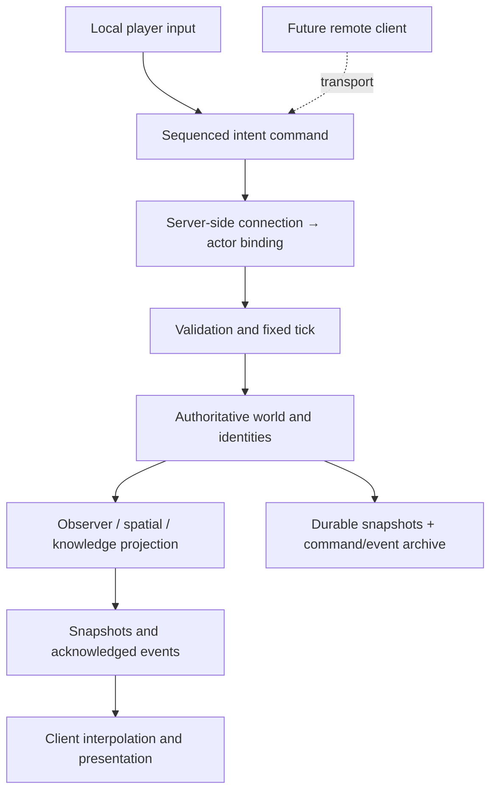

# Preparing for a shared sea

The long-term target may be an authoritative environment with roughly 100 people playing together. This alpha has **no networking**. A 100-person local simulation profile establishes only a useful starting point; it is not evidence that 100 clients, network serialization, persistence and rendering meet a production budget.

## Keep these boundaries

Commands contain intent and references; the server chooses the acting person from a trusted controller binding. Prices, ownership, hits, discoveries, relationships and consequences are server decisions. Inventory transfer and money transfer form one authority operation. Actor-local progress and knowledge must remain separate for every player.

Positions and IDs belong to the simulation, not a Godot scene or network connection. Disconnecting must not delete a person, ship, item or debt. Rendering may unload distant islands while the authority retains their life/history. Clients must never receive undiscovered terrain or private social state merely because it is convenient to render.

## Migration sequence

1. **Harden the local boundary.** Replace remaining presentation reads of mutable `WorldState` with immutable DTOs, including inventory, ship panel, market, journal and orbit queries. Add transactional command results and monotonic event acknowledgements. Make authority-only factories/role binding inaccessible to clients.
2. **Headless server host.** Host `IslandGlow.Core` without Godot. Add connection lifecycle, ownership handoff, disconnect expiry and reconnect binding. Decide what a disconnected character does (pause, AI watch, berth, or persistent vulnerability) before enabling combat online.
3. **Replication.** Build cell/ship/deck interest indexes. Replicate nearby visible actors at a suitable cadence, distant vessels at lower frequency, and only relevant chart/knowledge summaries. Send reliable ordered inventory/social transitions separately from replaceable movement snapshots. Enforce packet/command size and rate limits before deserialization reaches core operations.
4. **Client feel.** Interpolate other actors/vessels. Predict only reversible local motion and reconcile against the authoritative tick. Add explicit latency handling for melee, boarding and moving ship frames; do not trust client hit results.
5. **Durability.** Replace one local JSON slot with versioned server snapshots, a durable event/command log, transactional inventory/money storage, backups and migration tests. Preserve possession provenance through partitioning and recovery. Archive compacted history off the hot simulation path.
6. **Real load and failure tests.** Run 100 independent clients with representative travel, fighting, inventory, rumors and simultaneous docking. Measure CPU percentiles, allocation/GC, snapshot bytes, serialization, bandwidth, packet loss, reconnect storms, persistence stalls and a busy ship/port. Soak and crash/recover. Profile the render client separately.

## Current constraints that matter

| Area | Alpha position | Work before shared servers |
|---|---|---|
| Engine isolation | Core has zero Godot references; standalone checks run it | Server host, deployment, version negotiation |
| Authority | Controller-bound commands, replay checks, validation, expiring movement | Trusted authentication, rate limiting, durable acknowledgement and reconnect policy |
| Spatial scale | Double world coordinates, ship-relative actors, render-relative origin | Spatial indexes, moving-frame replication, streaming and server partitions if needed |
| Interest | Viewer projection filters distant people, decks, unknown charts and private beliefs | Complete DTO coverage, line-of-sight/privacy review, incremental replication |
| Relationships | Persistent directed graph and bounded personal knowledge | Sparse indexes; avoid evaluating every pair at large population sizes |
| Simulation | Deterministic seeded PRNG, fixed tick, exact save/continue tests | Deterministic command scheduling and cross-build replay compatibility |
| Economy | Finite cash/cargo, provenance, escrow, atomic core operations | Database transactions, idempotent persistence and crash recovery |
| Navigation | Local collision/steering, coarse ship separation | Congestion/pathfinding and actor separation for crowded ports/ships |
| History | Bounded hot events and personal summaries, persistent item histories | Cold archive, retention rules, efficient provenance queries |
| Time | Pause and 1×/4×/12× are local conveniences | One server clock; no per-client global pause or fast-forward |

The existing simulation uses straightforward dictionary/LINQ scans. Keep it readable until profiles identify a bottleneck; replace hot scans with explicit indexes when scaling. Do not prematurely distribute a world whose ownership and time rules are still changing. A single authoritative process with measured interest filtering is the first server target.
